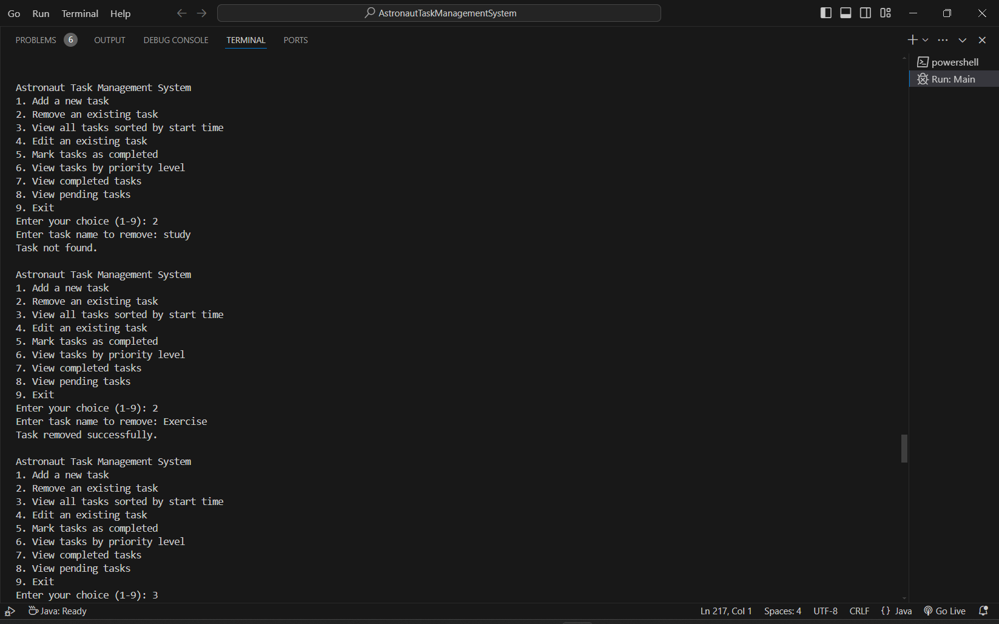
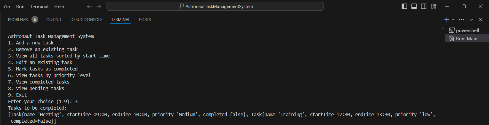
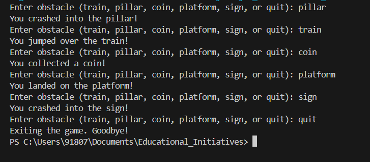
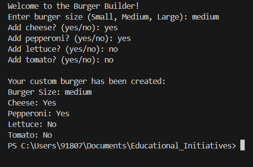
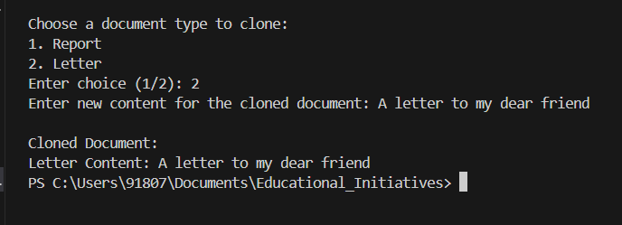
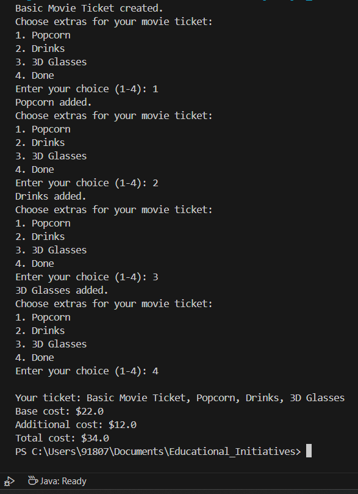
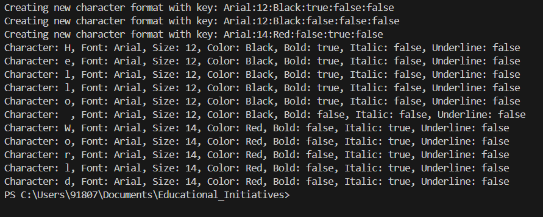
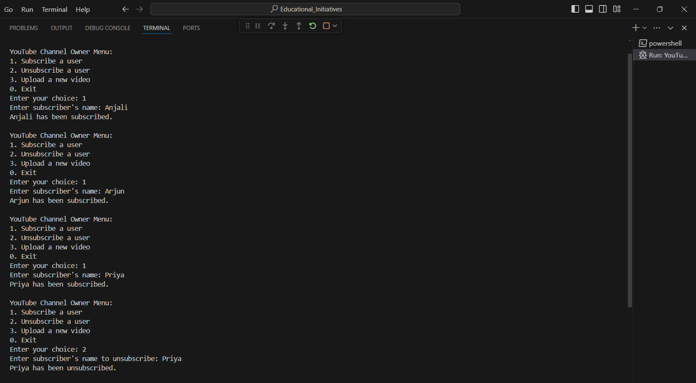
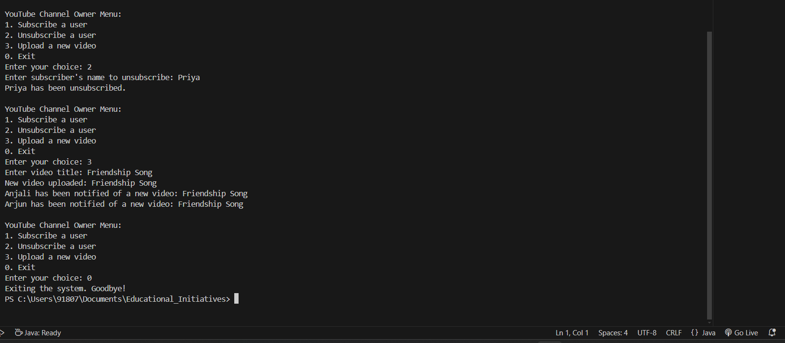

# 🚀 Astronaut Task Management System

Welcome to the Astronaut Task Management System! This console-based application efficiently manages tasks for astronauts during their missions. It includes features for task creation, scheduling, conflict detection, and reporting.

## 🎯 Features

- **Task Creation:** Create and manage tasks with specific deadlines and descriptions.
- **Task Scheduling:** Schedule tasks with accurate start and end times.
- **Conflict Detection:** Automatically detect and alert conflicts between tasks.
- **Observer Pattern:** Implement observers to monitor task changes and conflicts.
- **Logging:** Log actions performed within the application for audit purposes.
- **Task Status Tracking:** View completed and pending tasks.
- **User Interaction:** Console-based interaction for task management.


## 🛠️ Technologies Used

- **Programming Language:** Java
- **Design Patterns:** Singleton Pattern, Observer Pattern, Factory Pattern
- **Logging:** Custom Logger
- **Version Control:** Git

## 📋 Prerequisites

Before you begin, ensure you have the following installed:

- [Java Development Kit (JDK)](https://www.oracle.com/java/technologies/javase-downloads.html)
- [Git](https://git-scm.com/)

## 🚀 Installation

1. **Clone the Repository**
   ```bash
   git clone https://github.com/Pathu564/astronaut_task_managementsystem.git
   cd astronaut_task_managementsystem
   ```

2. **Compile the Project**
   ```bash
   cd src
   javac *.java
   ```

3. **Run the Application**
   ```bash
   java Main
   ```

## 📚 Modules Description

1. **Task Management**
   - Create Task: Add new tasks with descriptions and deadlines.
   - Delete Task: Remove tasks from the schedule.
   - Update Task: Edit existing task details.

2. **Task Scheduling**
   - Set Start and End Times: Schedule tasks with specific timings.
   - Conflict Detection: Detect and alert overlapping tasks automatically.

3. **Observer Pattern**
   - Register Observers: Implement observers to monitor task changes.
   - Notify Observers: Notify observers of any changes or conflicts.

4. **Logging**
   - Action Logging: Log actions such as task creation, updates, and deletions.
   - Custom Logger: Implement a custom logging solution for the application.

5. **Task Status Tracking**
   - View Completed Tasks: Display tasks marked as completed.
   - View Pending Tasks: Display tasks that are still pending.

## 🛡️ Design Patterns

This project incorporates several design patterns to ensure a scalable and maintainable codebase:

- **Singleton Pattern:** Ensures a single instance of the Schedule Manager for consistent task management.
- **Observer Pattern:** Used for conflict detection and task status updates.
- **Factory Pattern:** Simplifies task creation and management.

## 📈 Usage Instructions

Once the application is running, follow the console prompts to:

1. **Add a Task:** Input task details and schedule it.
2. **View Tasks:** See a list of all tasks sorted based on start time.
3. **Update Tasks:** Modify task details as needed.
4. **Delete Tasks:** Remove tasks from the list.
5. **Check Conflicts:** Automatically check for any task overlaps.
6. **Mark as Completed:** Mark task as Completed.
7. **View Task Status:** See completed and pending tasks.

## Add new Task


Task Conflict :


Tima invalid:


## Remove Existing Task

Checks both cases 



## View Tasks sorted by Start time



## Edit existing Task

Negative Case


## Mark as Completed, View Completed and Pending Tasks


---

## 🕹️ Subway Surfers Game - Strategy Pattern

### Overview

The Subway Surfers Game is a simple console-based game written in Java that demonstrates the use of the Strategy Design Pattern. The player encounters different types of obstacles, and a specific strategy is applied to handle each type.

### Code Structure

1. **`ObstacleStrategy.java`**: Defines the `ObstacleStrategy` interface.
2. **`TrainStrategy.java`**: Implements behavior for train obstacles.
3. **`PillarStrategy.java`**: Implements behavior for pillar obstacles.
4. **`CoinStrategy.java`**: Implements behavior for coin obstacles.
5. **`PlatformStrategy.java`**: Implements behavior for platform obstacles.
6. **`SignStrategy.java`**: Implements behavior for sign obstacles.
7. **`Player.java`**: Contains game logic and handles obstacles.
8. **`SubwaySurfersGame.java`**: Starts the game and manages the game loop.

### Installation

1. **Download or Clone the Repository**
2. **Navigate to Project Directory**
   ```bash
   cd /path/to/your_project_directory
   ```
3. **Compile the Java Files**
   ```bash
   javac *.java
   ```
4. **Run the Game**
   ```bash
   java SubwaySurfersGame
   ```

### Usage

- Enter the type of obstacle (train, pillar, coin, platform, sign) or `quit` to end the game.





---

## 🍔 Burger Builder System - Builder Pattern

### Overview

This project demonstrates the **Builder Pattern** through a customizable burger builder system, allowing users to create burgers with various ingredients.

### Design Pattern: Builder Pattern

- **Product:** `Burger` class.
- **Builder:** `BurgerBuilder` class.
- **Client:** `BurgerMaker` class.

### How It Works

1. **Builder Creation:** Set attributes for the burger.
2. **Burger Construction:** Create a `Burger` object with specified configurations.
3. **Interactive Menu:** Select burger size and ingredients.





### Installation

1. **Compile the Code**
2. **Run the Application**
3. **Interact with the Menu**

---

## 📝 Document Cloner System - Prototype Pattern

### Overview

This project showcases the **Prototype Pattern** for cloning and modifying documents.

### Design Pattern: Prototype Pattern

- **Prototype Interface:** `DocumentPrototype`
- **Concrete Prototypes:** `Report`, `Letter`
- **Client:** `DocumentCloner` class.

### How It Works

1. **Document Creation:** Create initial document prototypes.
2. **Cloning Documents:** Clone and modify documents.
3. **Modifying Content:** Update and display cloned documents.




### Installation

1. **Compile the Code**
2. **Run the Application**
3. **Interact with the Menu**

---

## 🎬 Movie Ticket System - Decorator Pattern

### Overview

This project demonstrates the **Decorator Pattern** for customizing movie tickets with optional extras like popcorn and drinks.

### Design Pattern: Decorator Pattern

- **Component Interface:** `MovieTicket`
- **Concrete Component:** `BasicTicket`
- **Decorator Class:** `TicketDecorator`
- **Concrete Decorators:** `PopcornDecorator`, `DrinksDecorator`, `GlassesDecorator`

### How It Works

1. **Base Ticket Creation:** Start with a basic ticket.
2. **Add Extras:** Enhance the ticket with additional features.
3. **Interactive Menu:** Choose extras to add to the ticket.




### Installation

1. **Compile the Code**
2. **Run the Application**
3. **Interact with the Menu**

---

## ✍️ Text Editor - Flyweight Pattern

### Overview

This project demonstrates the **Flyweight Pattern** in a text editor application for efficient character and style management.

### Design Pattern: Flyweight Pattern

- **Flyweight Interface:** Represents characters and styles.
- **Concrete Flyweights:** Shared elements like characters and styles.
- **Flyweight Factory:** Manages creation and reuse of flyweight objects.
- **Client:** Builds and manages documents.

### How It Works

1. **Shared State Creation:** Define common attributes.
2. **Unique State Handling:** Manage unique attributes.
3. **Flyweight Factory:** Create and reuse flyweights.
4. **Document Management:** Efficiently assemble documents.




### Installation

1. **Compile the Code**
2. **Run the Application**
3. **Edit Documents**

---

## 📺 YouTube Subscription System - Observer Pattern

### Overview

This project demonstrates the implementation of the **Observer Pattern** through a YouTube subscription system. The system allows a YouTube channel to notify its subscribers whenever a new video is uploaded. This pattern is used to manage and notify multiple subscribers efficiently when changes occur.

### Design Pattern: Observer Pattern

The **Observer Pattern** is a behavioral design pattern where an object (subject) maintains a list of its dependents (observers) and notifies them of any state changes. This pattern provides a way to subscribe and unsubscribe observers to be notified of changes in the subject.

### Components

- **Subject:** The `YouTubeChannel` interface defines methods for subscribing, unsubscribing, and notifying observers.
- **Concrete Subject:** `MyYouTubeChannel` class implements the `YouTubeChannel` interface and maintains a list of subscribers.
- **Observer:** The `Subscriber` interface defines the method `update` to receive notifications.
- **Concrete Observer:** `UserSubscriber` class implements the `Subscriber` interface to handle notifications of new videos.
- **Client:** The `ChannelOwnerMenu` class provides a menu for the channel owner to manage subscribers and upload videos.

### How It Works

1. **Subscription Management:** Subscribers can subscribe to or unsubscribe from the YouTube channel. Each subscriber is notified when a new video is uploaded.
2. **Video Upload:** When a new video is uploaded to the channel, all subscribed users receive a notification with the video title.
3. **Interactive Menu:** The system provides an interactive menu for the channel owner to perform operations like adding/removing subscribers and uploading new videos.






### How to Run

1. **Compile the Code:** Ensure all Java files are compiled.
2. **Run the Application:** Start the application to interact with the channel management system.
3. **Interact with the Menu:** Use the menu to add subscribers, remove them, or upload new videos. Subscribers will receive notifications based on their subscription status.

### Summary

This project showcases the Observer Pattern, where the YouTube channel acts as the subject, and subscribers are the observers

. The channel notifies all its subscribers when a new video is uploaded, illustrating how observers can be managed and notified effectively in a real-world scenario.

---

## 📞 Contact

For any questions or support, please contact:

- **GitHub:** [Pathu564](https://github.com/Pathu564)
- **Email:** [rpadmavathi2004@gmail.com](mailto:rpadmavathi2004@gmail.com)

---

